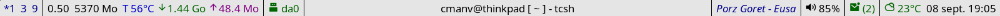

# tkstatus
Status bar for minimalist X11 window managers written in C and tcl/tk. 

## Introduction
This is a personal project specifically designed to run on my FreeBSD desktop with the cwm window manager. The main script uses tcl/tk 8.6.

The tcl language lacks the functions to access system information. But this is circumvented by using packages which are collections of C functions.
For my own use, I've written these 4 small packages to provide all the functionnality I need for a status bar. These packages can be build with cmake and the relevant libraries and header files installed.

The resulting shared libraries should be installed under **TCLLIBPATH**. The path of the relevant external libraries such as __libX11.so__ or __libmpdclient.so__ should be defined in **LD_PRELOAD**. In my case, this is done in the calling shell script __statusbar.sh__.

## Files
### statusbar.sh
This shell script should be called at startup in __.xinitrc__ or __.xsession__.

### statusbar.tk
This is the main script. It's highly likely that you'll want to modify it for your own system.

## Packages
### tclsysinfo
This package is system specific. The provided version was written for FreeBSD 13.x.
The following functions are provided:

* sysinfo::getloadavg :
Load average for the last minute.

* sysinfo::getusedmemswap :
Returns the used memory defined as active memory + wired memory. The amount of swap used is provided within parenthesis if any.

* sysinfo::getacpitemp :
Returns the content of __hw.acpi.thermal.tz0.temperature__ in celcius.

* sysinfo::getnetstats(if) :
Returns the amount data downloaded end uploaded on the given interface.

* sysinfo::getmixervol :
Returns the current volume of the mixer.

### tclxlib
This package provides a few functions to obtain information from the X display. You'll need standard X libraries and header files to build this on your system.

* xlib:init :
Initialize the connection to the X display. This should only called once.

* xlib::setdesktops :
Set the number of the first and last desktop. By default the first desktop is 0 and the last is 9.
On cwm, the first desktop should be set to 1.

* xlib::getactivewindowname :
Name of the selected window

* xlib::getcurrentdsktop :
Name of the selected desktop

* xlib::getlistuseddesktop :
List of active desktops spectrwm style. A desktop is considered active if a window is opened in it. A star marks the selected desktop.
 
### tclmpd
This package is used to return the currently playing song on the Music Player Daemon. It requires the __libmpdclient__ package and corresponding header files to build.

* mpd::connect(host) :
Connects to the currently running Music Player Daemon. The host can be a Unix socket or a resolvable internet address.

* mpd::currenttitle :
Returns the title of the song currently playing.

### tclshmem
This package allows basic ipc through a shared memory address. This supposes that a running application shares data on a known address. (On my desktop, it's a small weather app.)

* shmem::read(address) :
Returns the content of the shared memory address.

* shmem::write(address) :
Writes content to the shared memory address.

* shmem::delete(address) :
Removes the shared memory address.

## Themes

The bar has a light and dark theme built-in. (the dark theme being based on **Nord**)
The theme is auto-selected based on the content of the file __~/.cache/theme/default__. The content of this file can be controlled by a script for switching between a dark or light theme.

## Unicode font

The script uses some icons from the __remixicon__ unicode font to be displayed next to some devices names. Theses need to be adjusted if you're using a different unicode font.

## Maildir

The function __mailboxes_setup__ of the tcl/tk script looks for maildirs under the root folder __$HOME/.maildir__ (variable __maildir__)
The accounts available under this root folder can be defined in __accountlist__. These should be actual folders in maildir format.
